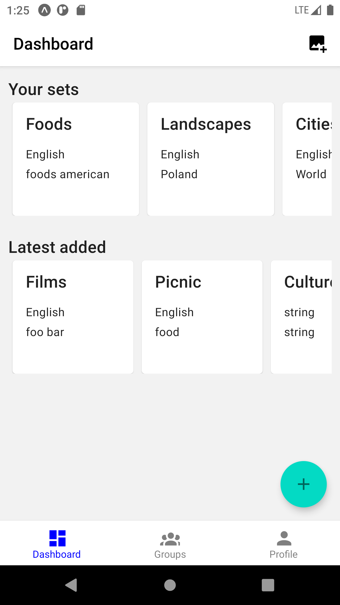
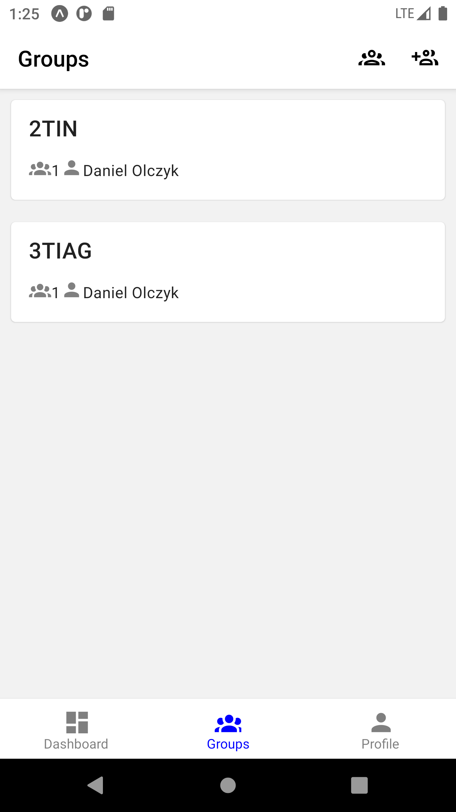
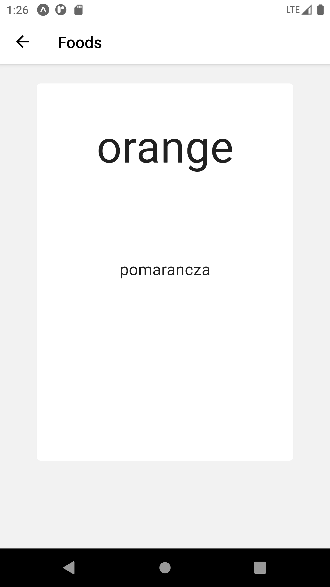
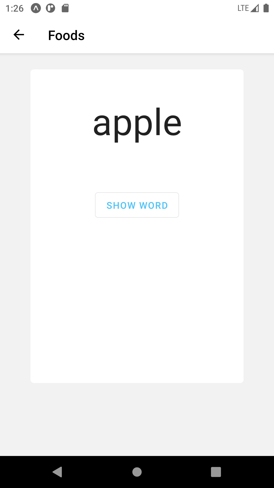
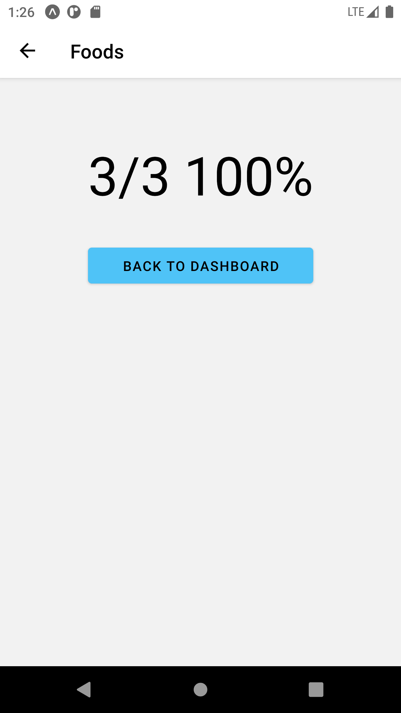
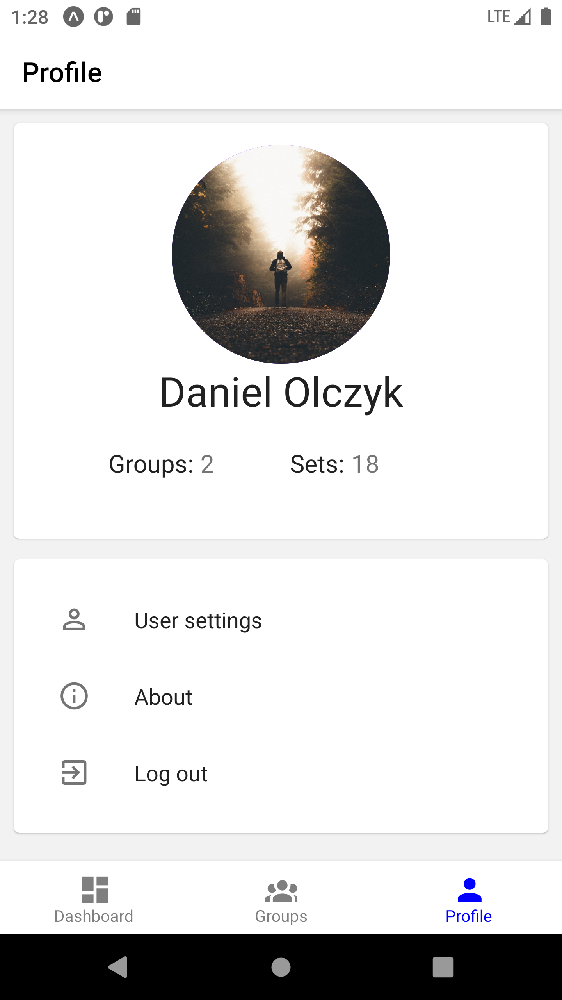
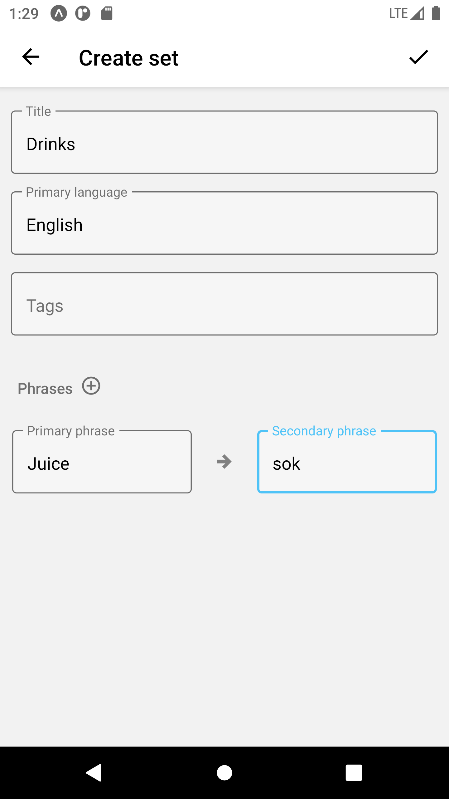

# LERN

Aplikacja, która wpomaga naukę języków obcych poprzez szybsze dodawanie słówek, sprawdzenia wymowy, łatwego udostępniania w grupie zestawów.

### W jakim celu ta aplikacja powstała

Głównie powstała w celu pomocy osobom, którzy są leniwi do nauki lub chcą w bardzo prosty sposób zapamiętać słówka oraz do łatwiejszego udostępnienia zestawów przez nauczycieli.

### Wykorzystane technologie
* React Native z Expo
* React Native Paper
* ASP.NET Core 5
* PostgreSQL
* EF Core 5
* Cloudinary
* Docker
* Azure Computer Vision

### Zaimplementowane funkcjonalności

* tworzenie zestawu
* tryb nauki
* system grup (wersja okrojona)
* odczytywanie słówek z zdjęcia
* dashboard
* profil użytkownika

### W Planach

* Tryb nauki w postaci quizu i testu
* wyszukiwanie zestawu
* rozszerzenie funkcjonalności grup (dodawanie grupowych fiszków)
* rozpoznawanie poprawnej wymowy słówka lub zdania (poprzez technologię Azure Text to speech)

### Wygląd aplikacji








### Jak uruchomić aplikację (wesja debug)

* .NET >= 5.0
* NodeJS >= 14.X
* Docker >= 20.10.12
* Docker Compose >= 1.29

Domyślnie konfiguracja POSTGRES_CONNECTION_STRING jest ustawiona na `Server=localhost;Database=lern;Uid=test;Pwd=123;` 
można ją zmienić w ./backend/src/Lern.Api/appsettings.json. Jest niezbędnie potrzebna do zrobienia migracji bazy danych.

docker-compose (potrzebna do uruchomienia PostgreSQL):
```bash
$ docker volume create lern-db-postgresql
$ docker-compose -f docker-compose.dev.yml up -d
```

backend:
```bash
$ cd backend
$ dotnet tool install --global dotnet-ef --version 6.0.1
$ dotnet ef database update --project src/Lern.Infrastructure
$ dotnet build
$ dotnet run --project src/Lern.Api
```

app (Android i iOS):
```bash
$ cd app
$ yarn start
```

### Jak uruchomić aplikację (wesja release)

* .NET >= 5.0
* NodeJS >= 14.X
* Docker >= 20.10.12
* Docker Compose >= 1.29

Przed uruchomieniem backendu potrzebne jest dodanie zmiennej środowiskowej POSTGRES_CONNECTION_STRING i wartość ustawić jako format do połączenia się z bazy PostgreSQL ([przykład tutaj](https://www.connectionstrings.com/postgresql/)).
Jest niezbędnie potrzebna do zrobienia migracji bazy danych.

docker-compose (potrzebna do uruchomienia PostgreSQL):
```bash
$ docker volume create lern-db-postgresql
// Zanim zaczniemy uruchamiać kontenery, najpierw trzeba ustawić wartości zmiennych w pliku docker-compose.production.yml
$ docker-compose -f docker-compose.production.yml up -d
```

backend:
```bash
$ cd backend
$ dotnet tool install --global dotnet-ef --version 6.0.1
$ dotnet ef database update --project src/Lern.Infrastructure
$ dotnet build -c Release
$ dotnet run src/Lern.Api/bin/Release/Lern.Api.dll
```

app (Android):
```bash
$ npm install -g turtle-cli
$ cd app
$ turtle setup:android
$ turtle build:android
```

app (iOS - wymagany system operacyjny macOS):
```bash
$ npm install -g turtle-cli
$ cd app
$ turtle setup:ios
$ turtle build:ios
```